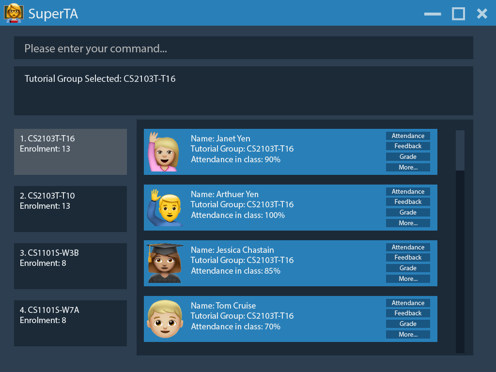
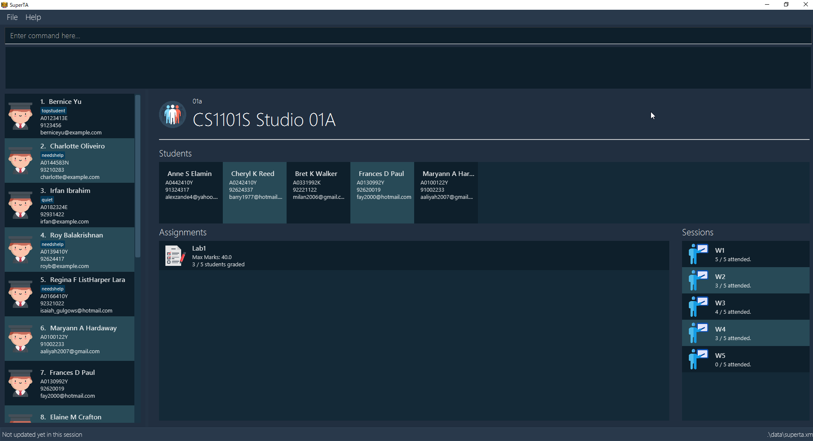

= SuperTA
ifdef::env-github,env-browser[:relfileprefix: docs/]

https://travis-ci.org/CS2103-AY1819S1-T16-2/main[image:https://travis-ci.org/CS2103-AY1819S1-T16-2/main.svg?branch=master[Build Status]]
https://ci.appveyor.com/project/Caephler/main[image:https://ci.appveyor.com/api/projects/status/nf0mimtyhamj6l8e?svg=true[Build status]]
https://coveralls.io/github/CS2103-AY1819S1-T16-2/main?branch=master[image:https://coveralls.io/repos/github/CS2103-AY1819S1-T16-2/main/badge.svg?branch=master[Coverage Status]]

ifdef::env-github[]

endif::[]

Welcome to SuperTA, the one-stop station to help YOU become the ultimate teaching assistant (TA). Say no more to attendance sheets, Excel spreadsheets and feedback forms!

ifdef::env-github[]

endif::[]

SuperTA is a desktop management application made for TAs to keep track on students progress and attendance. It has a GUI but most of the user interactions happen using a CLI (Command Line Interface).

With just a few simple commands, you can

* Search for student records
* take and track attendance of each student
* record and view feedback for each student
* and many more.

== Site Map

* <<UserGuide#, User Guide>>
* <<DeveloperGuide#, Developer Guide>>
* <<AboutUs#, About Us>>
* <<ContactUs#, Contact Us>>

== Acknowledgements

* This application is built and enhanced from https://github.com/se-edu/addressbook-level4[se-edu/addressbook-level 4]
* Some parts of this sample application were inspired by the excellent http://code.makery.ch/library/javafx-8-tutorial/[Java FX tutorial] by
_Marco Jakob_.
* Libraries used: https://github.com/TestFX/TestFX[TextFX], https://bitbucket.org/controlsfx/controlsfx/[ControlsFX], https://github.com/FasterXML/jackson[Jackson], https://github.com/google/guava[Guava], https://github.com/junit-team/junit5[JUnit5]

== License : link:LICENSE[MIT]
